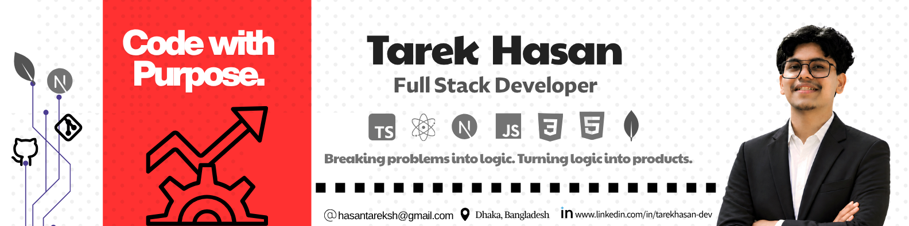

<!-- Profile Banner -->

  

 

<ul align="center">
  

    <h1 style="display: inline-block">Hello World! 👋</h1>
  

</ul>

<!-- Typing Animation -->

  

 

## ABOUT ME

- 👨‍💻 Hi, I’m [**Tarek Hasan**](https://github.com/tarekhasan-dev)
- 🎯 I’m an **Aspiring Full Stack Web Developer** focused on building modern and real-world web applications.
- 🧩 Currently strengthening my **full-stack development** and software engineering skills.
- 📚 Continuously learning through **hands-on projects, problem-solving, and practical development**.
- 💡 Ask me about **JavaScript, Frontend Development, Git and GitHub**.
- 🚀 Passionate about creating **clean, scalable and user-focused applications**.
- 🔬 Exploring **AI, Machine Learning, Cybersecurity and Data Science**.
- 📬 Reach me at [**Email**](mailto:hasantareksh@gmail.com)

 

<h3 align="left">
  
  FOLLOW ME ON SOCIALS:
</h3>

  

  

  

  

  

 

<!-- Tech Stack -->

<h2 align="left">
  
  Tech Stack
</h2>

 

# 📊 GitHub Stats:
 
 

## 🏆 GitHub Trophies

---

<!-- Proudly created with GPRM ( https://gprm.itsvg.in ) -->
